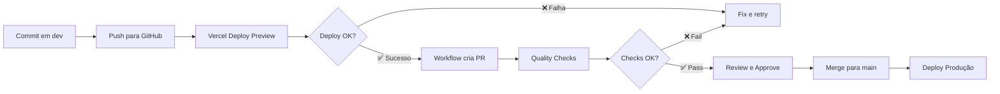

# Workflows GitHub Actions

Este projeto utiliza automação via GitHub Actions para garantir qualidade e agilizar o processo de deploy.

## 📋 Workflows Disponíveis

### 1. Auto PR para Main (`auto-pr-to-main.yml`)

**Trigger**: Após deploy bem-sucedido na branch `dev` (Vercel)

**Função**: Cria automaticamente um Pull Request de `dev` para `main` quando o deploy preview é bem-sucedido.

**Fluxo**:
1. ✅ Deploy em `dev` é concluído com sucesso na Vercel
2. 🤖 Workflow detecta o evento `deployment_status`
3. 🔍 Verifica se já existe PR aberto de dev → main
4. 📝 Cria novo PR ou atualiza PR existente com comentário
5. 🏷️ Adiciona labels: `auto-deploy`, `ready-for-review`

**Permissões necessárias**:
- `contents: write` - Para ler código
- `pull-requests: write` - Para criar/comentar PRs

**Checklist incluída no PR**:
- [ ] Build passou sem erros
- [ ] Deploy preview testado e validado
- [ ] Core Web Vitals dentro do esperado
- [ ] Formulário de leads funcionando
- [ ] Analytics configurado corretamente
- [ ] Sem regressões visuais

---

### 2. Validação de Qualidade (`quality-check.yml`)

**Trigger**: Pull Request para branch `main`

**Função**: Executa verificações de qualidade antes de permitir merge.

**Verificações executadas**:

#### Type Check
```bash
pnpm run type-check
```
Valida tipagem TypeScript em todo o projeto.

#### Lint
```bash
pnpm run lint
```
Verifica padrões de código com ESLint.

#### Build
```bash
pnpm run build
```
Garante que o projeto compila sem erros.

#### Bundle Size
Calcula e reporta tamanho do bundle JavaScript.

#### Lighthouse CI (Performance)
- **URLs testadas**: `http://localhost:3000`
- **Runs**: 3 (média de resultados)
- **Métricas**:
  - Performance Score
  - Accessibility Score
  - Best Practices Score
  - SEO Score
  - Core Web Vitals (LCP, FID, CLS)

**Artifacts**:
- Relatórios Lighthouse salvos para cada run
- Disponíveis na aba "Actions" do GitHub

---

## 🚀 Como Usar

### Fluxo Padrão de Deploy



### Passo a Passo

1. **Desenvolver na branch `dev`**
   ```bash
   git checkout dev
   git add .
   git commit -m "feat: nova funcionalidade"
   git push origin dev
   ```

2. **Aguardar deploy automático**
   - Vercel faz deploy preview automaticamente
   - Acesse URL de preview para testar

3. **PR automático é criado**
   - Workflow detecta sucesso do deploy
   - PR aparece em "Pull Requests"
   - Checklist incluída para validação

4. **Validações executam automaticamente**
   - Type check, lint, build
   - Lighthouse CI (performance)
   - Resultados aparecem no PR

5. **Review e Merge**
   - Revisar mudanças
   - Validar checklist
   - Aprovar e fazer merge
   - Deploy em produção acontece automaticamente

---

## ⚙️ Configuração

### Permissões do GitHub Token

O workflow usa o token automático `github.token` que já tem as permissões configuradas no arquivo YAML:

```yaml
permissions:
  contents: write
  pull-requests: write
```

**Nada precisa ser configurado manualmente!** ✅

### Variáveis de Ambiente (Opcional)

Para notificações Slack, adicione em **Settings > Secrets**:

```
SLACK_WEBHOOK - URL do webhook do Slack
```

Depois descomente a seção "Notificar Slack" no workflow.

---

## 🔧 Customização

### Alterar ambiente de deploy

Por padrão, detecta deploy em `Preview – dev`. Para mudar:

```yaml
github.event.deployment.environment == 'Preview – dev'
```

Altere para o nome do ambiente desejado.

### Adicionar mais verificações

Edite `quality-check.yml` e adicione novos steps:

```yaml
- name: Minha Verificação
  run: npm run meu-script
```

### Configurar auto-merge (avançado)

Para merge automático após aprovação, adicione ao final do `auto-pr-to-main.yml`:

```yaml
- name: Auto-merge se aprovado
  if: github.event.review.state == 'approved'
  run: gh pr merge --auto --squash
```

---

## 📊 Monitoramento

### Ver execuções

1. Acesse aba **Actions** no GitHub
2. Selecione o workflow desejado
3. Veja logs detalhados de cada step

### Badges de status

Adicione ao README.md:

```markdown


```

---

## 🐛 Troubleshooting

### Workflow não executa

**Problema**: Workflow não é disparado após deploy

**Solução**:
1. Verifique se Vercel tem permissão para enviar webhooks
2. Confirme que a branch é `dev`
3. Veja logs em Actions > Workflow runs

### PR não é criado

**Problema**: Deploy sucesso mas PR não aparece

**Solução**:
1. Verifique permissões do GitHub token
2. Confirme que não existe PR aberto já
3. Veja logs do workflow em Actions

### Quality checks falham

**Problema**: Build ou lint falhando

**Solução**:
1. Execute localmente: `npm run build && npm run lint`
2. Corrija erros encontrados
3. Faça novo commit
4. Workflow re-executa automaticamente

---

## 📚 Recursos

- [GitHub Actions Docs](https://docs.github.com/en/actions)
- [Vercel Deploy Hooks](https://vercel.com/docs/concepts/git/vercel-for-github)
- [Lighthouse CI](https://github.com/GoogleChrome/lighthouse-ci)

---

**Automação configurada e pronta para uso!** 🎉
